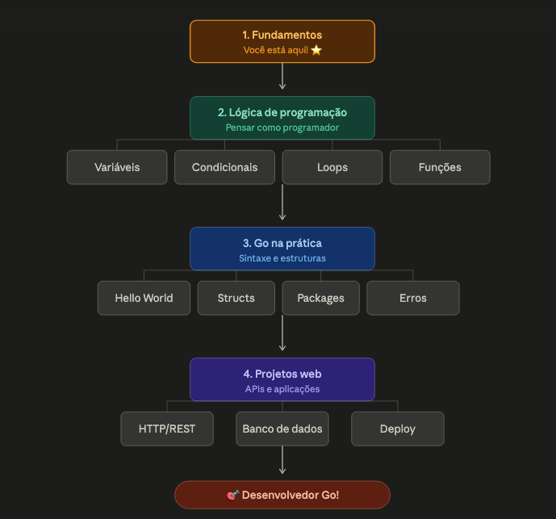
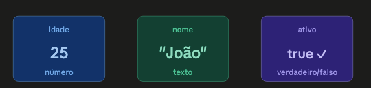
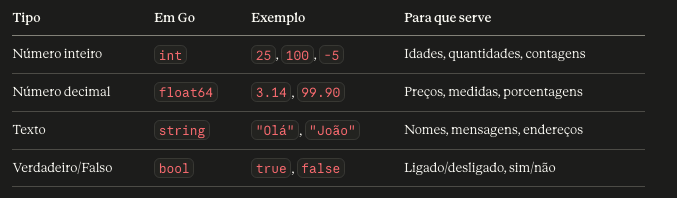
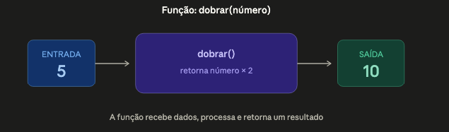
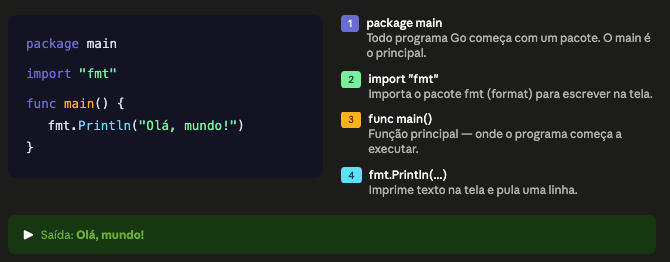
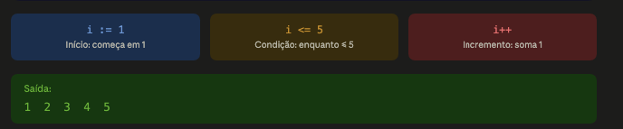
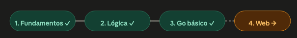

# Fundamentos da Programação

Programação é simplesmente dar instruções para o computador. Quando você programa, você escreve um "roteiro" que o computador segue passo a passo.

Assim como usamos Português para conversar com pessoas, usamos linguagens de programação para "conversar" com computadores. Go (ou Golang) é uma dessas linguagens.
Cada linguagem tem suas regras (sintaxe), assim como o Português tem gramática.

## O que é Lógica de Programação?
É a forma de pensar para resolver problemas. Antes de escrever código, você precisa saber o quê quer fazer. A lógica é universal — se você aprende a pensar logicamente, pode programar em qualquer linguagem.
Os 3 pilares da lógica:

Sequência   > Fazer uma coisa de cada vez, em ordem
Decisão     > Se acontecer X, faça Y. Senão, faça Z
Repetição   > Repita isso até conseguir o resultado

### Variáveis: Caixas para guardar informações
Uma variável é como uma caixa com um nome, onde você guarda um valor.
Exemplo do dia a dia:

- Caixa chamada idade → guarda o número 25
- Caixa chamada nome → guarda o texto "João"
- Caixa chamada logado → guarda verdadeiro ou falso

### Os 3 tipos básicos de dados:

### Condicionais: Tomando decisões
A vida é cheia de decisões: SE está chovendo, ENTÃO leve guarda-chuva, SENÃO vá sem.
Programação funciona igual!

### Loops: Repetindo ações
Imagine que você precisa contar de 1 até 5. Em vez de escrever 5 comandos, você usa um loop (laço de repetição).

### Funções: Blocos reutilizáveis
Uma função é um bloco de código com um nome que você pode usar várias vezes. Pense como uma receita de bolo — você escreve uma vez e pode fazer o bolo sempre que quiser.

## Go na Prática
Chegou a hora de colocar a mão no código! Vamos transformar tudo que você aprendeu em código Go real.

### Seu primeiro programa: Hello World!
Todo programador começa assim. Vamos entender cada parte:

### Variáveis em Go
[Forma 1]
var nome    string  = "Joao"
var idade   int     = 25
var ativo   bool    = true

[Forma 2]
nome    := "Joao""
idade   := 25
ativo   := true

### Condicionais em Go (if/else)

[pseudocódigo]
idade := 17
SE idade >= 18 ENTAO
    mostrar "Maior de idade"
SENAO
    mostrar "Menor de idade"
FIM

[go]

''''
idade := 17
if idade >= 18 {
    fmt.Println("Maior de idade")
} else {
    fmt.Println("Menor de idade")
}
''''

### Loops em Go (for)
Go usa apenas for para todos os tipos de repetição
for i := 1; i <= 5; i++{
    fmt.Println(i)
}

### Funções em Go

''''
package main

import "fmt"

// Função que recebe um número e retorna o dobro
func dobrar(numero int) int {
    return numero * 2
}

func main() {
    resultado := dobrar(5)
    fmt.Println("O dobro de 5 é:", resultado)
}
'''''

