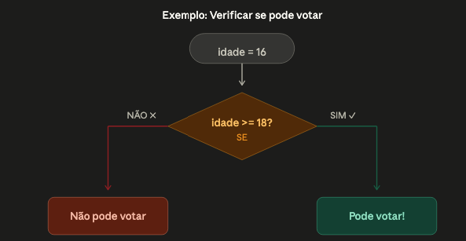

# Fundamentos da Programação


---

## Sumário

- [Introdução](#introdução)
- [Lógica de Programação](#lógica-de-programação)
- [Variáveis](#variáveis-caixas-para-guardar-informações)
- [Tipos de Dados](#os-3-tipos-básicos-de-dados)
- [Condicionais](#condicionais-tomando-decisões)
- [Loops](#loops-repetindo-ações)
- [Funções](#funções-blocos-reutilizáveis)
- [Go na Prática](#go-na-prática)
- [Hello World](#seu-primeiro-programa-hello-world)
- [Variáveis em Go](#variáveis-em-go)
- [Condicionais em Go](#condicionais-em-go-ifelse)
- [Loops em Go](#loops-em-go-for)
- [Funções em Go](#funções-em-go)

---

## Introdução

Programação é simplesmente dar instruções para o computador. Quando você programa, você escreve um "roteiro" que o computador segue passo a passo.

Assim como usamos Português para conversar com pessoas, usamos linguagens de programação para "conversar" com computadores. Go (ou Golang) é uma dessas linguagens.

Cada linguagem tem suas regras (sintaxe), assim como o Português tem gramática.

---

## Lógica de Programação

É a forma de pensar para resolver problemas. Antes de escrever código, você precisa saber o que quer fazer.

A lógica é universal — se você aprende a pensar logicamente, pode programar em qualquer linguagem.

### Os 3 pilares da lógica:

- Sequência → Fazer uma coisa de cada vez, em ordem  
- Decisão → Se acontecer X, faça Y. Senão, faça Z  
- Repetição → Repita isso até conseguir o resultado  


---

## Variáveis: Caixas para guardar informações

Uma variável é como uma caixa com um nome, onde você guarda um valor.

### Exemplos:

- `idade` → guarda o número 25  
- `nome` → guarda o texto "João"  
- `logado` → guarda verdadeiro ou falso  


---

## Os 3 tipos básicos de dados:


---

## Condicionais: Tomando decisões

A vida é cheia de decisões:

SE está chovendo → leve guarda-chuva  
SENÃO → vá sem  

Programação funciona da mesma forma.



---

## Loops: Repetindo ações

Imagine que você precisa contar de 1 até 5.  
Em vez de escrever vários comandos, você usa um loop.

---

## Funções: Blocos reutilizáveis

Uma função é um bloco de código reutilizável.

Pense como uma receita: você escreve uma vez e pode usar sempre que precisar.


---

# Go na Prática

Hora de aplicar os conceitos em código.

---

## Seu primeiro programa: Hello World!


---

## Variáveis em Go

### Forma 1
```go
var nome string = "Joao"
var idade int = 25
var ativo bool = true